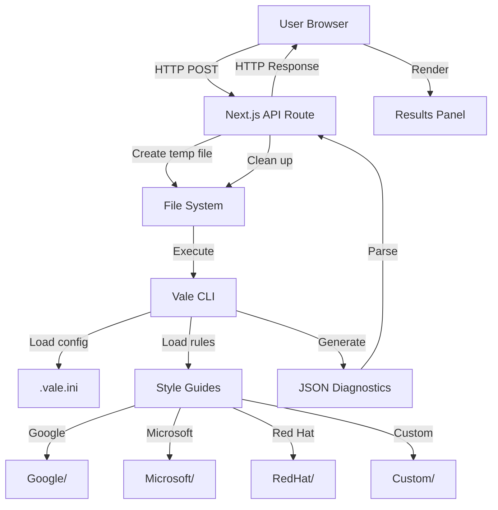

## System Overview

Verbalize is a modern web application built with Next.js that provides real-time documentation linting through Vale CLI integration. The architecture emphasizes simplicity, security, and performance.

## Tech Stack

<CardGroup cols={2}>
  <Card title="Frontend" icon="browser">
    - **React 19.2.3** - UI components
    - **Next.js 16.1.6** - App Router framework
    - **TypeScript** - Type safety
    - **Tailwind CSS 4** - Styling
    - **Lucide React** - Icon system
    - **next-themes** - Dark mode
    - **react-markdown** - Preview rendering
  </Card>
  <Card title="Backend" icon="server">
    - **Next.js API Routes** - Serverless endpoints
    - **Node.js** - Runtime environment
    - **Vale CLI** - Prose linting engine
    - **Child Process** - CLI execution
    - **File System APIs** - Temp file handling
  </Card>
</CardGroup>

### Complete Technology Breakdown

| Component | Technology | Version | Purpose |
|-----------|-----------|---------|------|
| Framework | Next.js (App Router) | 16.1.6 | Server-side rendering and routing |
| Language | TypeScript | 5+ | Type-safe development |
| UI Library | React | 19.2.3 | Component-based UI |
| Styling | Tailwind CSS | 4 | Utility-first CSS framework |
| Icons | Lucide React | 0.563.0 | Icon system |
| Linter | Vale CLI | Latest | Prose linting engine |
| Markdown | react-markdown | 10.1.0 | Preview rendering |
| Testing | Playwright | 1.58.1 | End-to-end testing |
| Theme | next-themes | 0.4.6 | Dark mode support |

## Architecture Diagram



## Request-Response Flow

Detailed breakdown of what happens when a user clicks "Run Linting":

<Steps>
  <Step title="User Input Processing">
    User text is captured from the editor and normalized:
    ```typescript app/page.tsx:55-59
    // Normalize newlines to \n for consistent line/column reporting
    const normalizedText = text.replace(/\r\n/g, '\n');
    if (normalizedText !== text) {
      setText(normalizedText);
    }
    ```
  </Step>

  <Step title="API Request">
    Frontend sends POST request to `/api/lint`:
    ```typescript app/page.tsx:64-68
    const response = await fetch('/api/lint', {
      method: 'POST',
      headers: { 'Content-Type': 'application/json' },
      body: JSON.stringify({ text: normalizedText, style, customRules }),
    });
    ```
  </Step>

  <Step title="Validation">
    API route validates input against security constraints:
    ```typescript app/api/lint/route.ts:21-43
    if (!text || typeof text !== 'string') {
      return NextResponse.json({ error: 'No text provided' }, { status: 400 });
    }

    if (text.length > MAX_TEXT_LENGTH) {
      return NextResponse.json({ error: 'Text exceeds maximum allowed length' }, { status: 400 });
    }

    if (!ALLOWED_STYLES.includes(style)) {
      return NextResponse.json({ error: 'Invalid style guide selected' }, { status: 400 });
    }
    ```
  </Step>

  <Step title="Temporary File Creation">
    Create temporary directory and write text to file:
    ```typescript app/api/lint/route.ts:45-47
    const tmpDir = await fs.mkdtemp(path.join(os.tmpdir(), 'vale-'));
    const tmpFile = path.join(tmpDir, 'doc.md');
    await fs.writeFile(tmpFile, text);
    ```
  </Step>

  <Step title="Style Directory Setup">
    Create temporary styles directory with symlinks to existing styles and custom rules:
    ```typescript app/api/lint/route.ts:50-68
    const tempStylesDir = path.join(tmpDir, 'styles');
    await fs.mkdir(tempStylesDir, { recursive: true });

    // Symlink existing styles
    const stylesPath = path.join(process.cwd(), 'styles');
    const existingStyles = await fs.readdir(stylesPath);
    for (const styleFolder of existingStyles) {
      await fs.symlink(fullPath, path.join(tempStylesDir, styleFolder), 'dir');
    }
    ```
  </Step>

  <Step title="Custom Rules Processing">
    If custom rules provided, create Custom style directory:
    ```typescript app/api/lint/route.ts:72-95
    if (customRules && customRules.length > 0) {
      const customStyleDir = path.join(tempStylesDir, 'Custom');
      await fs.mkdir(customStyleDir, { recursive: true });

      // Add meta.json for Vale recognition
      await fs.writeFile(path.join(customStyleDir, 'meta.json'), JSON.stringify({
        name: 'Custom',
        description: 'User-uploaded rules'
      }));

      // Write each rule with sanitized filename
      for (const rule of customRules) {
        const safeRuleName = baseName.replace(/[^a-zA-Z0-9._-]/g, '_');
        await fs.writeFile(path.join(customStyleDir, safeRuleName), rule.content);
      }

      basedOnStyles = `${style}, Custom`;
    }
    ```
  </Step>

  <Step title="Vale Configuration">
    Generate temporary `.vale.ini` file:
    ```typescript app/api/lint/route.ts:100-107
    const valeIni = `
    StylesPath = ${tempStylesDir}
    MinAlertLevel = suggestion
    [*.md]
    BasedOnStyles = ${basedOnStyles}
    `;
    const iniFile = path.join(tmpDir, '.vale.ini');
    await fs.writeFile(iniFile, valeIni);
    ```
  </Step>

  <Step title="Vale Execution">
    Execute Vale CLI with configuration:
    ```typescript app/api/lint/route.ts:119-136
    try {
      const { stdout } = await execFileAsync(valePath, [
        `--config=${iniFile}`,
        '--output=JSON',
        tmpFile
      ]);
      const results = JSON.parse(stdout);
      return NextResponse.json(results[tmpFile] || []);
    } catch (error) {
      // Vale returns non-zero exit code if it finds alerts
      if (execError.stdout) {
        const results = JSON.parse(execError.stdout);
        return NextResponse.json(results[tmpFile] || []);
      }
    }
    ```
  </Step>

  <Step title="Cleanup">
    Remove temporary files:
    ```typescript app/api/lint/route.ts:138-143
    finally {
      try {
        await fs.rm(tmpDir, { recursive: true, force: true });
      } catch (rmError) {
        console.error('Failed to remove temp directory:', rmError);
      }
    }
    ```
  </Step>

  <Step title="Response Processing">
    Frontend receives and displays results:
    ```typescript app/page.tsx:70-75
    const data = await response.json();
    if (response.ok && Array.isArray(data)) {
      setResults(data as ValeAlert[]);
    } else {
      alert('Linting failed: ' + (data.error || 'Unknown error'));
    }
    ```
  </Step>
</Steps>

## Repository Structure

```plaintext
verbalize/
├── app/
│   ├── api/
│   │   └── lint/
│   │       └── route.ts          # Core API endpoint for Vale integration
│   ├── components/
│   │   └── ThemeProvider.tsx     # Dark mode provider
│   ├── layout.tsx                # Root layout component
│   ├── page.tsx                  # Main application interface (482 lines)
│   ├── globals.css               # Global styles
│   └── favicon.ico               # Favicon
├── styles/
│   ├── Google/                   # Google Developer Documentation Style Guide
│   │   ├── meta.json
│   │   └── *.yml (rules)
│   ├── Microsoft/                # Microsoft Writing Style Guide
│   │   ├── meta.json
│   │   └── *.yml (rules)
│   └── RedHat/                   # Red Hat Documentation Style Guide
│       ├── meta.json
│       └── *.yml (rules)
├── scripts/
│   └── install-vale.js           # Vale binary installation script
├── tests/
│   ├── e2e.spec.ts               # End-to-end tests
│   └── verify_ui_improvements.spec.ts
├── public/
│   └── example-style.yml         # Example custom rule
├── .vale.ini                     # Vale configuration file
├── netlify.toml                  # Netlify deployment configuration
├── next.config.ts                # Next.js configuration
├── tsconfig.json                 # TypeScript configuration
├── package.json                  # Project dependencies and scripts
└── README.md                     # Project documentation
```

## Component Architecture

### Main Application Component

The primary UI is a single-page application in `app/page.tsx`:

```typescript
interface ValeAlert {
  Action: { Name: string; Params: string[] | null };
  Span: [number, number];
  Check: string;
  Description: string;
  Link: string;
  Message: string;
  Severity: string;
  Match: string;
  Line: number;
}

interface CustomRule {
  name: string;
  content: string;
}

function Home() {
  // State management
  const [text, setText] = useState('');
  const [style, setStyle] = useState('Google');
  const [customRules, setCustomRules] = useState<CustomRule[]>([]);
  const [results, setResults] = useState<ValeAlert[]>([]);
  const [loading, setLoading] = useState(false);
  const [sidebarOpen, setSidebarOpen] = useState(true);
  const { theme, setTheme } = useTheme();

  // Three-column layout
  return (
    <div className="flex h-screen">
      <aside>{/* Settings sidebar */}</aside>
      <main className="grid grid-cols-3">
        <section>{/* Editor */}</section>
        <section>{/* Preview */}</section>
        <section>{/* Results */}</section>
      </main>
    </div>
  );
}
```

### Key Features Implementation

#### 1. Synchronized Scrolling

```typescript app/page.tsx:130-138
const handleScroll = (e: React.UIEvent<HTMLElement>) => {
  const source = e.currentTarget;
  const target = source === editorRef.current ? previewRef.current : editorRef.current;

  if (target) {
    const percentage = source.scrollTop / (source.scrollHeight - source.clientHeight);
    target.scrollTop = percentage * (target.scrollHeight - target.clientHeight);
  }
};
```

#### 2. Alert Navigation

Click on an alert to jump to that location in the editor:

```typescript app/page.tsx:140-196
const handleAlertClick = (alert: ValeAlert, e: React.MouseEvent) => {
  const textarea = editorRef.current;
  const lines = textarea.value.split('\n');
  let offset = 0;

  // Calculate character offset
  for (let i = 0; i < Math.min(alert.Line - 1, lines.length); i++) {
    offset += lines[i].length + 1;
  }

  const start = offset + alert.Span[0] - 1;
  const end = offset + alert.Span[1];

  // Use shadow textarea for scroll calculation
  const shadow = document.createElement('textarea');
  // Copy styles...
  shadow.value = currentValue.substring(0, end);
  const scrollTo = shadow.scrollHeight - (textarea.clientHeight / 2);
  textarea.scrollTop = Math.max(0, scrollTo);

  textarea.focus();
  textarea.setSelectionRange(start, end);
};
```

#### 3. Theme Persistence

```typescript app/components/ThemeProvider.tsx
import { ThemeProvider as NextThemesProvider } from 'next-themes';

export function ThemeProvider({ children }: { children: React.ReactNode }) {
  return (
    <NextThemesProvider attribute="class" defaultTheme="system">
      {children}
    </NextThemesProvider>
  );
}
```

## Security Measures

Verbalize implements multiple security layers:

### 1. Input Validation

```typescript app/api/lint/route.ts:10-14
const ALLOWED_STYLES = ['Google', 'Microsoft', 'RedHat'];
const MAX_TEXT_LENGTH = 1024 * 1024; // 1MB
const MAX_CUSTOM_RULES = 10;
const MAX_RULE_LENGTH = 10 * 1024; // 10KB
```

### 2. Path Traversal Prevention

```typescript app/api/lint/route.ts:88-93
const baseName = path.basename(ruleName);
const safeRuleName = baseName.replace(/[^a-zA-Z0-9._-]/g, '_');
if (!safeRuleName || safeRuleName === '.' || safeRuleName === '..') {
  continue;
}
```

### 3. Temporary File Isolation

Each request gets its own isolated temporary directory:
```typescript
const tmpDir = await fs.mkdtemp(path.join(os.tmpdir(), 'vale-'));
// Process...
finally {
  await fs.rm(tmpDir, { recursive: true, force: true });
}
```

### 4. XSS Prevention

ReactMarkdown is secure by default and does not render HTML unless explicitly configured with `rehype-raw`.

## Performance Characteristics

### Processing Times

| Document Size | Style Guides | Average Time |
|--------------|--------------|-------------|
| < 1,000 words | Single | ~200ms |
| 1,000-5,000 words | Single | ~500ms |
| 5,000-10,000 words | Single | ~1s |
| < 1,000 words | All three | ~400ms |
| 5,000-10,000 words | All three | ~1.4s |

### Memory Usage

- Base memory: ~50MB
- Per request: +10-20MB (temporary files)
- Peak during Vale execution: ~100MB

### Scaling Considerations

<Warning>
**Concurrent Requests**: Multiple simultaneous lint operations may require request queuing or rate limiting in high-traffic scenarios.
</Warning>

**Netlify Functions** have a 10-second timeout by default. For larger documents:
```toml netlify.toml
[functions]
  timeout = 30
```

## Design Philosophy

Verbalize follows these core principles:

### 1. Minimal Cognitive Load
Interface prioritizes the writing workspace with non-intrusive feedback.

### 2. Real-time Feedback
Linting results appear immediately without page reloads.

### 3. Accessibility First
All interactive elements include proper ARIA labels:
```typescript
<textarea
  aria-label="Text editor for documentation linting"
  // ...
/>
```

### 4. Progressive Enhancement
Core functionality works without JavaScript (forms submit, Vale processes server-side).

## Testing Architecture

### End-to-End Tests with Playwright

```typescript tests/e2e.spec.ts
import { test, expect } from '@playwright/test';

test('should lint documentation and display results', async ({ page }) => {
  await page.goto('http://localhost:3000');
  
  // Type in editor
  await page.fill('textarea', 'This is a test document.');
  
  // Select style guide
  await page.selectOption('select', 'Google');
  
  // Run linting
  await page.click('button:has-text("Run Linting")');
  
  // Verify results appear
  await expect(page.locator('.results-panel')).toBeVisible();
});
```

## Deployment Architecture

### Netlify Deployment Flow

<Steps>
  <Step title="Git Push">
    Developer pushes code to GitHub
  </Step>
  <Step title="Build Trigger">
    Netlify detects changes and starts build
  </Step>
  <Step title="Dependencies">
    `npm install` runs, including `postinstall` script that installs Vale
  </Step>
  <Step title="Next.js Build">
    `next build` compiles application
  </Step>
  <Step title="Function Deployment">
    API routes become Netlify Functions
  </Step>
  <Step title="Asset Upload">
    Static assets and styles uploaded to CDN
  </Step>
  <Step title="DNS Update">
    Changes go live at configured domain
  </Step>
</Steps>

## Extensibility

Verbalize is designed to be extended:

### Adding New Style Guides

1. Add style directory to `styles/`
2. Update `ALLOWED_STYLES` constant
3. Update UI dropdown

### Custom Integrations

The API can be called from external tools:
```bash
curl -X POST https://your-instance.netlify.app/api/lint \
  -H "Content-Type: application/json" \
  -d '{"text":"Your documentation","style":"Google"}'
```

## Related Resources

<CardGroup cols={2}>
  <Card title="API Reference" icon="code" href="/api-reference/overview">
    Detailed API documentation
  </Card>
  <Card title="Vale Integration" icon="puzzle-piece" href="/api-reference/vale-integration">
    How Vale CLI is integrated
  </Card>
  <Card title="Deployment Guide" icon="rocket" href="/deployment/setup">
    Deploy your own instance
  </Card>
  <Card title="Contributing" icon="github" href="/resources/contributing">
    Contribute to the project
  </Card>
</CardGroup>